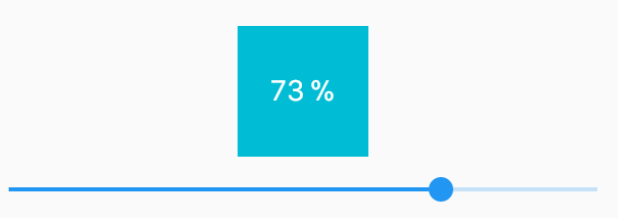

# painted progress button

An [example of Flutter animated widget](https://github.com/rxlabz/painted_progress_widget/) based on a [CustomPainter](https://docs.flutter.io/flutter/rendering/CustomPainter-class.html).

## Step 2



```dart
import 'package:flutter/material.dart';

void main() => runApp(new App());

class App extends StatelessWidget {
  @override
  Widget build(BuildContext context) {
    return MaterialApp(
      home: Scaffold(
        body: ProgressButtonDemo(),
      ),
    );
  }
}

class ProgressButtonDemo extends StatefulWidget {
  @override
  _ProgressButtonDemoState createState() => new _ProgressButtonDemoState();
}

class _ProgressButtonDemoState extends State<ProgressButtonDemo> {
  double progress = 0.0;

  @override
  Widget build(BuildContext context) {
    return new Column(
      mainAxisAlignment: MainAxisAlignment.center,
      children: <Widget>[
        Text("${progress.round()} %"),
        Slider(
          value: progress,
          min: 0.0,
          max: 100.0,
          onChanged: (double value) => setState(() => progress = value),
        )
      ],
    );
  }
}

```

___

## Getting Started with Flutter

For help getting started with Flutter, view our online
[documentation](https://flutter.io/).
