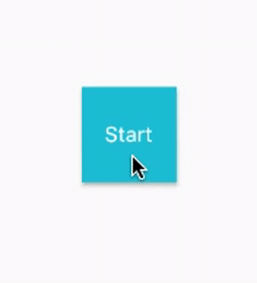

# painted progress button

An example of Flutter animated widget based on a [CustomPainter](https://docs.flutter.io/flutter/rendering/CustomPainter-class.html).



```dart
class _ProgressButtonPainter extends CustomPainter {
  final double progress;
  final Color fillColor;
  final Color progressColor;
  final Color backgroundColor;
  final Rect innerRect;

  _ProgressButtonPainter({
    this.progress,
    this.fillColor: Colors.cyan,
    this.backgroundColor: Colors.cyan,
    this.progressColor: Colors.lime,
    this.innerRect,
  });

  @override
  void paint(Canvas canvas, Size size) {
    final fillRect = Offset.zero & size;

    if (progress == 0.0 || progress == 100.0)
      canvas.drawShadow(Path()..addRect(fillRect), Colors.black, 2.0, true);

    final fill = Paint()
      ..style = PaintingStyle.fill
      ..color = backgroundColor;
    canvas.drawRect(fillRect, fill);

    final progressFill = Paint()
      ..style = PaintingStyle.fill
      ..color = progressColor;
    canvas.drawRect(
        new Rect.fromPoints(
            Offset.zero, Offset(size.width * progress / 100, size.height)),
        progressFill);

    if (progress > 0.0 && progress < 100.0)
      canvas.drawShadow(Path()..addRect(innerRect), Colors.black, 2.0, true);

    final innerFill = Paint()
      ..style = PaintingStyle.fill
      ..color = fillColor;
    canvas.drawRect(innerRect, innerFill);
  }

  @override
  bool shouldRepaint(_ProgressButtonPainter oldDelegate) {
    return oldDelegate.progress != progress ||
        oldDelegate.fillColor != fillColor ||
        oldDelegate.innerRect != innerRect ||
        oldDelegate.progressColor != progressColor ||
        oldDelegate.backgroundColor != backgroundColor;
  }
}
```

___

## Getting Started with Flutter

For help getting started with Flutter, view our online
[documentation](https://flutter.io/).
